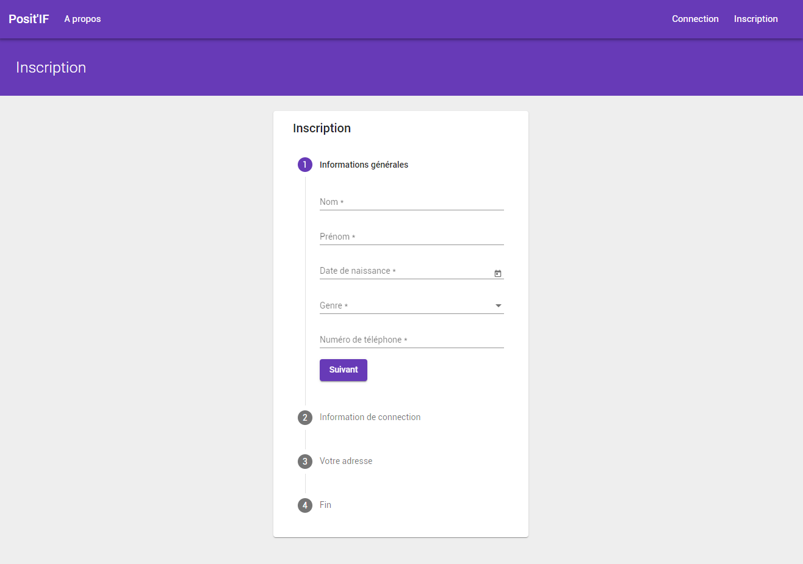
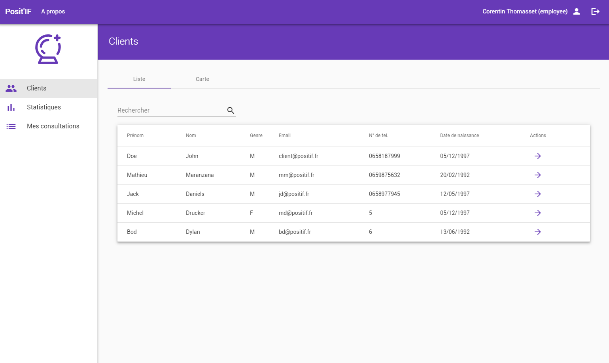
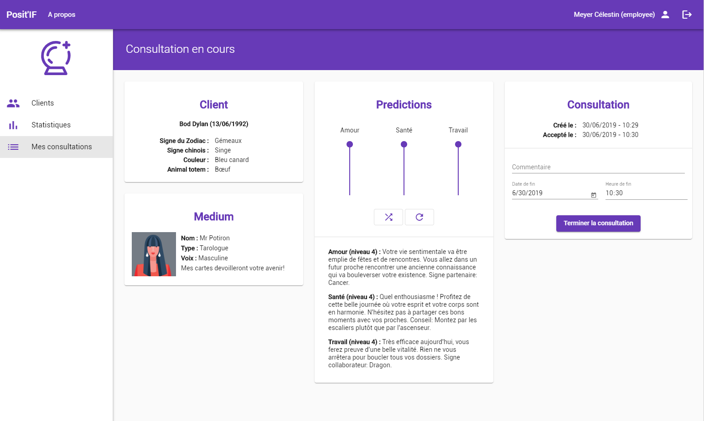
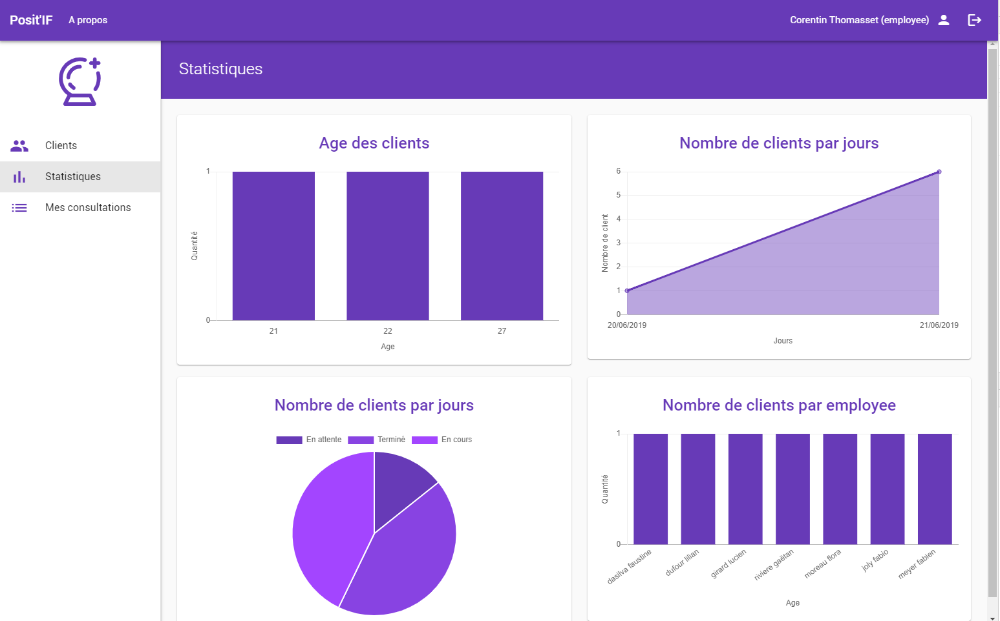

# POSIT'IF FRONTEND
School project @INSA-Lyon.

## What is it ?
POSIT'IF is a clairvoyance service by phone. His internatonally recognized mediums have been selected with the utmost rigor, and come together to work with precision, honesty and seriousness in their respectve specialty: clairvoyance, tarology or astrology. Their personalized predictions for each client answer all the questions of a sentmental, professional or fnancial order in the strictest respect of the deontology (mediums are role played by POSIT'IF employees).

## How ?
This application is structured in 3 smaller parts **[services](https://github.com/CorentinTh/positif-services)**, **[backend](https://github.com/CorentinTh/positif-backend)** and **[frontend](https://github.com/CorentinTh/positif-frontend)**.

## Screenshots

## Credit
Application made by [Balthazar Frolin](https://github.com/Balthov60) and [Corentin Thomasset](https://github.com/CorentinTh).

* **[Backend](https://github.com/CorentinTh/positif-backend)**: [Balthazar Frolin](https://github.com/Balthov60)
* **[Frontend](https://github.com/CorentinTh/positif-frontend)**: [Corentin Thomasset](https://github.com/CorentinTh)
* **[Services](https://github.com/CorentinTh/positif-services)**: [Balthazar Frolin](https://github.com/Balthov60) and [Corentin Thomasset](https://github.com/CorentinTh)

## About the FRONTEND

This project was generated with [Angular CLI](https://github.com/angular/angular-cli) version 7.3.9.

### Development server

Run `ng serve` for a dev server. Navigate to `http://localhost:4200/`. The app will automatically reload if you change any of the source files.

### Code scaffolding

Run `ng generate component component-name` to generate a new component. You can also use `ng generate directive|pipe|service|class|guard|interface|enum|module`.

### Build

Run `ng build` to build the project. The build artifacts will be stored in the `dist/` directory. Use the `--prod` flag for a production build.

### Running unit tests

Run `ng test` to execute the unit tests via [Karma](https://karma-runner.github.io).

### Running end-to-end tests

Run `ng e2e` to execute the end-to-end tests via [Protractor](http://www.protractortest.org/).

### Further help

To get more help on the Angular CLI use `ng help` or go check out the [Angular CLI README](https://github.com/angular/angular-cli/blob/master/README.md).
